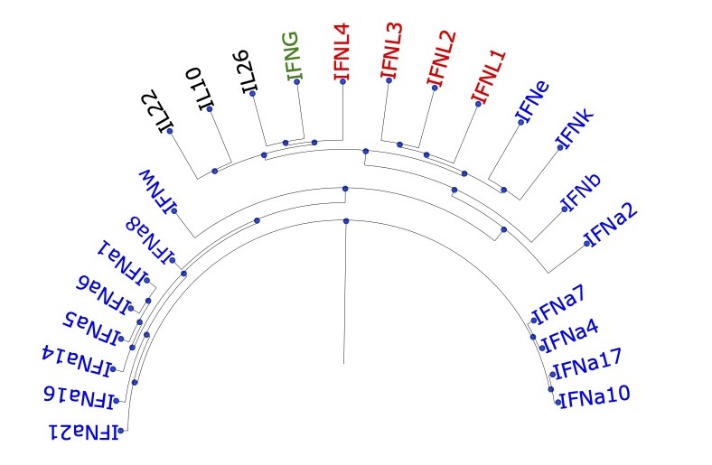

# Phylogenetic-Analyses
Phylogenetic Analyses with python library BioPython
Based on https://taylor-lindsay.github.io/phylogenetics/

# Reproduct result on your own
Require pyenv installed 
You can consult https://github.com/pyenv/pyenv to use this package
Require python version 3.9 installed with python
Require installation of packages described in requirements.txt (done by run_main.sh)
Once requirements fullfilled, run the script run_main.sh with the following command in your terminal:
/bin/bash run_main.sh
Should open a windows with the following representation :

